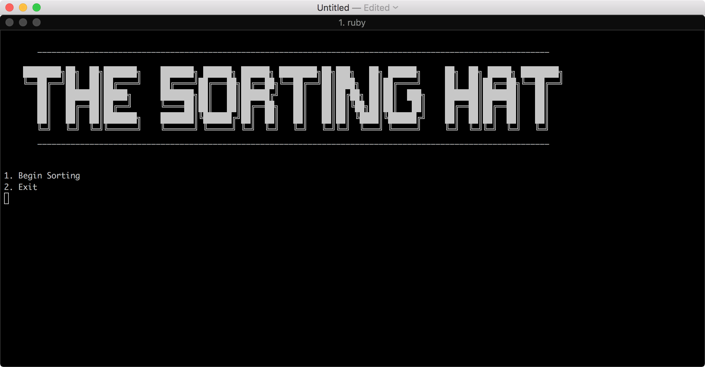
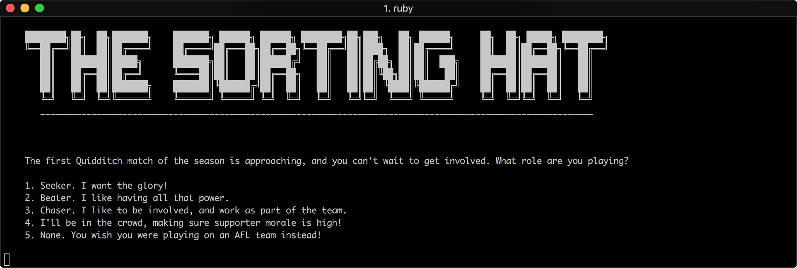
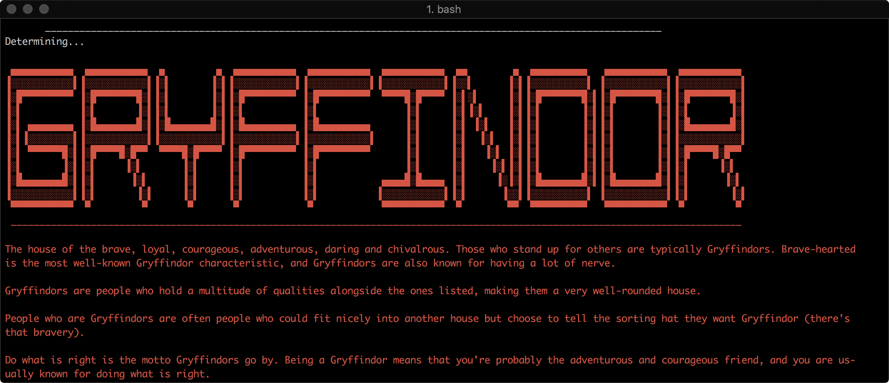

# Harry Potter Hat Sorter Quiz
A Quiz asking users a series of Harry Potter themed questions to determine which house they belong to in the Harry Potter universe.

## Usage
---
**In Terminal**

Open Terminal to file location and enter:
```bash
$ ruby sorting_hat.rb
```


## Screenshots
**Starting Screen:**


**Question Example:**


**Possible End Result:**



## Planning
---
**Our General Idea**

Create a Harry Potter Sorting Hat Quiz with a bunch of Harry Potter questions with some ideas from the Fallout 3 G.O.A.T (Generalized Occupational Aptitude Test), and we also added an Aussie twist to a few of the answers.

**Workflow Board**


## Installation
Users will also need to download the **colorize** ruby gem by running this code in terminal:
```bash
$ gem install colorize
```

## Limitations
### 1.
With our code, the answers will have to be the same order, meaning if the user was to choose answer option 1, it will always give Gryffindor a point, so we can't put the Slytherin answer for answer option 1 because it'll give Gryffindor a point and NOT SLYTHERIN.
 
 

 ```ruby
     if answer == 1
        gryffindor_points += 1
    elsif answer == 2
        slytherin_points += 1
    elsif answer == 3
        hufflepuff_points += 1
    elsif answer == 4
        ravenclaw_points += 1
```
_We can maybe bypass this limitation by maybe using an array to store data, and use .push method to add in certain values (1 - 4) into our array and then count which appears more often to determine the winning house._

### 2.
With our point scoring system, if the user scores an equal amount of points for 2 of the house points, it'll choose whichever house is first in our if statement.


## Polishing up our code
We decided to split the code into 3 files, to make it easier to read. We have the main file, questions file and the ascii text file.

For the questions we made them into methods, and called upon them in our while loop.

We made the big ASCII text into class constants. We could've achieved this by making them into methods as well, but we wanted to expand our knowledge, and try out different methods to call things into our main file.

We added a bunch of sleep and clear commands to make it prettier and seem more user friendly when the user runs the program.

We added Text to Speech commands to make it more interactive.


## Authors
---
Yong Liang

Sam Ludwig

